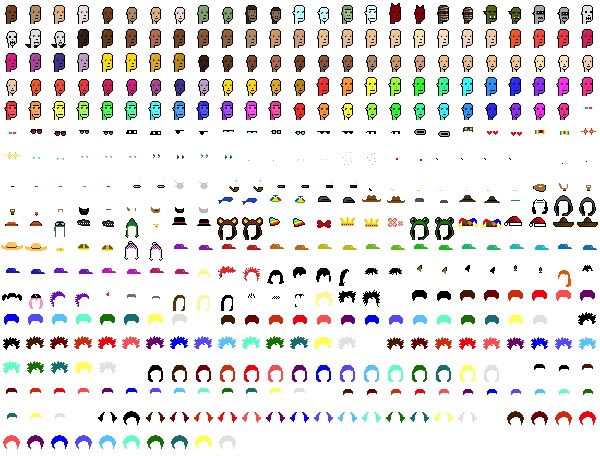

# Punk Sprite Sheet - A Unicode-Like Universal Code Page for All Punk (Pixel) Head / Character Archetypes & Attributes in 24×24px in a Free to Download Single Sprite Sheet Image

Version 2022

[**Free Image Download - spritesheet.png**](https://github.com/cryptopunksnotdead/punks.spritesheet/raw/master/spritesheet.png) (~65k)

## Meta Data Records - Id, Name, Type & More

For the punk "sprite" meta data records (id, name, type, etc.)
of the sprite sheet
in the comma-separated values (csv) format, see
[**spritesheet.csv**](spritesheet.csv).

## Questions? Comments?

Post them on the [D.I.Y. Punk (Pixel) Art reddit](https://old.reddit.com/r/DIYPunkArt). Thanks.

